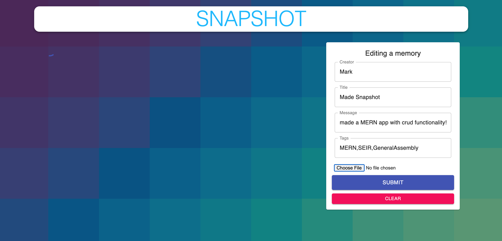

# SNAPSHOT
Is currnetlty an open source blog where users can make a post about anything they'd like with the option to add a picture!  

## Project Link
### [SNAPSHOT](https://github.com/markrissmiller/snapshot-frontend)

## Contributors
* **Mark Rissmiller** https://github.com/markrissmiller

## Technologies Used
* JavaScript
* HTML5
* CSS
* React.js
* MongoDB
* Express
* node.js
* materialUI

## Challenges/Future Goals/ Bugs
* The next step is to add User Auth and specific user features
* My first MERN Stack application 

## Screenshots
  

## Special Thanks
* Thank you to the General Assembly SEIR-ERICA instructional team and classmates for support and mentorship. 